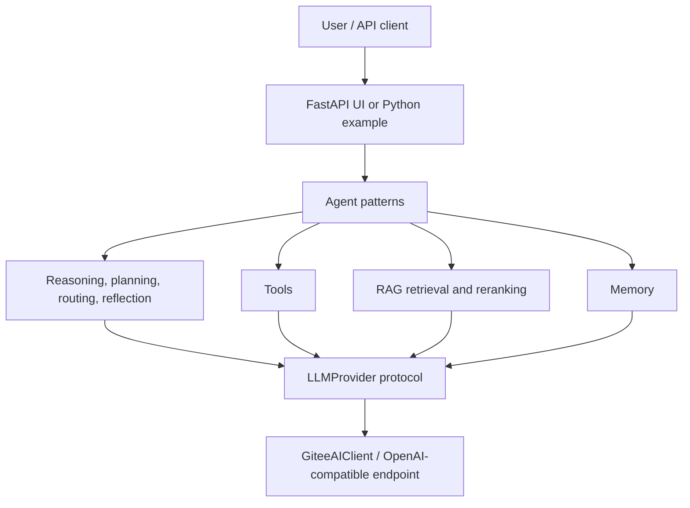

# shuyixiao-agent

> Runnable reference implementations for learning, testing, and combining modern AI agent patterns in Python.

[中文说明](#中文说明) · [Documentation](docs/README.md) · [Examples](examples/README.md) · [Contributing](CONTRIBUTING.md) · [Roadmap](ROADMAP.md)

`shuyixiao-agent` is a developer-oriented open-source agent engineering playground built with LangGraph, FastAPI, and OpenAI-compatible model APIs. It favors inspectable code and runnable examples over a large framework abstraction.

## Why shuyixiao-agent

Many agent tutorials stop at an article or a minimal chat loop. This repository collects implementations that developers can run, debug, modify, combine, and test: tool use, planning, reflection, routing, parallel work, prompt chains, memory, multi-agent collaboration, and RAG.

This is a reference project, not a claim of production readiness. Networked examples require your own compatible API credentials; offline tests and the first example require none.

## Core capabilities

| Capability | Implementation | Location |
| --- | --- | --- |
| Conversation graph | `SimpleAgent` | `src/shuyixiao_agent/agents/simple_agent.py` |
| ReAct-style tool loop | `ToolAgent`, `ToolUseAgent` | `src/shuyixiao_agent/agents/` |
| Planning | `PlanningAgent` | `agents/planning_agent.py` |
| Reflection | `ReflectionAgent` | `agents/reflection_agent.py` |
| Routing | rule, keyword, LLM, and hybrid strategies | `agents/routing_agent.py` |
| Parallelization | parallel tasks and aggregation strategies | `agents/parallelization_agent.py` |
| Prompt chaining | reusable multi-step chains | `agents/prompt_chaining_agent.py` |
| Multi-agent | role-based collaboration workflows | `agents/multi_agent_collaboration.py` |
| Memory | in-memory indexes and optional JSON persistence | `agents/memory_agent.py` |
| RAG | vector, BM25, hybrid retrieval, reranking, context management | `src/shuyixiao_agent/rag/` |
| Tool calling | basic, predefined, and LLM-powered tools | `src/shuyixiao_agent/tools/` |
| Web/API | FastAPI service and static UI | `src/shuyixiao_agent/web_app.py` |
| Deployment | Dockerfile and Compose configuration | repository root |
| Evaluation | deterministic offline cases | `evals/` |

## Architecture



The agent layer accepts a small provider interface where practical. `GiteeAIClient` remains the default and backward-compatible implementation.

## Quick start

Requirements: Python 3.12+.

```bash
git clone https://github.com/shuyixiao-better/shuyixiao-agent.git
cd shuyixiao-agent
python -m venv .venv
# Windows: .venv\Scripts\activate
# macOS/Linux: source .venv/bin/activate
python -m pip install -e ".[dev]"
python examples/00_offline_quickstart.py
```

The offline quick start exercises routing and tools without a key or network access.

To run model-backed examples and the Web UI:

```bash
cp .env.example .env        # Windows PowerShell: Copy-Item .env.example .env
# Edit .env and set GITEE_AI_API_KEY
python examples/01_simple_chat.py
python run_web.py
```

Open `http://localhost:8000`. Never commit `.env` or API keys. TLS verification is enabled by default.

## Agent patterns

| Pattern | What it demonstrates | Code | Example |
| --- | --- | --- | --- |
| ReAct / tools | alternate model decisions and tool observations | `tool_agent.py` | `02_tool_agent.py` |
| Prompt chaining | pass each step's output into the next prompt | `prompt_chaining_agent.py` | `11_prompt_chaining_simple.py` |
| Routing | select a specialist handler by rules, keywords, or an LLM | `routing_agent.py` | `12_routing_agent_demo.py` |
| Parallelization | execute independent tasks and aggregate results | `parallelization_agent.py` | `13_parallelization_agent_demo.py` |
| Reflection | critique and iteratively improve an answer | `reflection_agent.py` | `14_reflection_agent_demo.py` |
| Planning | decompose a goal and execute dependency-aware tasks | `planning_agent.py` | `16_planning_agent_demo.py` |
| Multi-agent | coordinate role-based expert workflows | `multi_agent_collaboration.py` | `17_multi_agent_collaboration_demo.py` |
| Memory | store, filter, retrieve, and persist memories | `memory_agent.py` | `18_memory_agent_demo.py` |

See the [example matrix](examples/README.md) for requirements and commands.

## Project structure

```text
src/shuyixiao_agent/   installable Python package
  agents/              agent pattern implementations
  rag/                 document loading, retrieval, reranking, context
  tools/               built-in tool implementations and registry
  web_app.py            FastAPI endpoints and static UI
examples/              runnable learning examples
tests/                 deterministic unit and integration tests
evals/                 reproducible behavior evaluations
docs/                  guides and architecture notes
.github/                CI and contribution templates
```

`code_merge_assistant/` is a separate experimental application retained in this repository; it is not part of the installable `shuyixiao_agent` package.

## Development

```bash
python -m ruff check .
python -m pytest
python -m compileall -q src examples evals
python -m build
```

CI runs without `GITEE_AI_API_KEY` and executes only deterministic offline tests/evals. See [CONTRIBUTING.md](CONTRIBUTING.md).

## Documentation

- [Documentation index](docs/README.md)
- [Quick-start guide](docs/快速开始.md)
- [API reference](docs/API%20参考文档.md)
- [RAG guide](docs/RAG%20%28检索增强生成%29%20使用指南.md)
- [Repository audit](docs/REPOSITORY_AUDIT.md)

## Roadmap, security, and releases

- [Roadmap](ROADMAP.md)
- [Security policy](SECURITY.md)
- [Changelog](CHANGELOG.md)
- [Release process](RELEASE.md)

## Contributing

Bug fixes, tests, examples, documentation, tool integrations, and focused agent-pattern improvements are welcome. Read [CONTRIBUTING.md](CONTRIBUTING.md) before opening a pull request.

## License

[MIT](LICENSE)

## 中文说明

这是一个面向开发者的开源 Agent 工程实践项目，通过可直接运行和检查的 Python 代码展示现代 AI Agent 的核心模式。项目重点是学习、调试、组合与验证，不宣称达到生产级框架的成熟度。

第一次使用建议先运行无需 API Key 的 `examples/00_offline_quickstart.py`，再配置 `.env` 体验模型驱动示例和 Web 界面。完整导航见 [中文文档中心](docs/README.md)。
